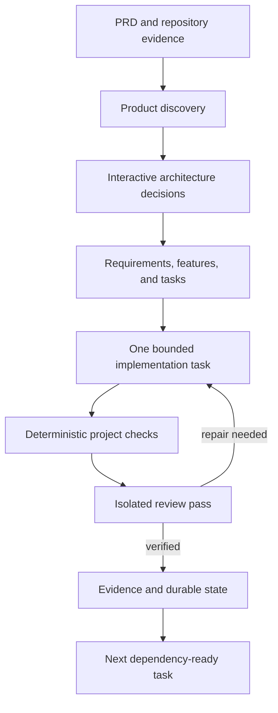

# Vega SDD

**Turn a PRD into a repository-owned, reviewable software delivery workflow.**

Vega SDD is an open-source control plane for building software with Cursor, Codex, Claude Code, Gemini CLI, or GitHub Copilot CLI. Product intent, architecture decisions, tasks, checks, review evidence, changes, and recovery state stay in the repository, so work can continue across terminals, sessions, and coding agents.

> **Status: 0.4.0 alpha.** The framework has 205 automated tests, Python 3.11/3.12 CI, package-build checks, incident-lifecycle benchmarks, and cross-project Python/Node/SQLite benchmarks. Real agent credentials, hosted branch protection, deployment hooks, and application-specific safety remain your responsibility. See [0.4.0 verification](https://github.com/teja499-tech/vega-sdd/blob/main/docs/VERIFICATION_0.4.0.md).

## Choose your starting point

| You have | Start here |
| --- | --- |
| An idea, but no PRD | [Create a PRD with ChatGPT or Claude](https://github.com/teja499-tech/vega-sdd/blob/main/docs/PRD_DISCOVERY.md) |
| A PRD and an empty repository | [Greenfield journey](https://github.com/teja499-tech/vega-sdd/blob/main/docs/USE_CASES.md#1-build-a-new-application-from-a-prd) |
| An existing application to enhance | [Brownfield journey](https://github.com/teja499-tech/vega-sdd/blob/main/docs/USE_CASES.md#2-add-a-feature-to-an-existing-application) |
| A defect in an SDD-managed project | [Defect journey](https://github.com/teja499-tech/vega-sdd/blob/main/docs/USE_CASES.md#3-fix-a-defect-without-changing-approved-intent) |
| A changed requirement or architecture decision | [Change journey](https://github.com/teja499-tech/vega-sdd/blob/main/docs/USE_CASES.md#4-change-an-approved-requirement) |
| A paused, failed, or interrupted run | [Recovery journey](https://github.com/teja499-tech/vega-sdd/blob/main/docs/USE_CASES.md#5-resume-or-recover-work) |
| A completed application needing documentation | [Adoption journey](https://github.com/teja499-tech/vega-sdd/blob/main/docs/USE_CASES.md#8-adopt-and-document-a-mature-application) |

## Five-minute safe trial

Requires Python 3.11 or later. The mock adapter exercises the lifecycle without changing application code or requiring an agent login.

```bash
python -m pip install vega-sdd

mkdir vega-demo
cd vega-demo
git init
printf '# Notes API\n\nBuild an API where a user can create and list notes. Persist notes and include tests.\n' > PRD.md

sdd init --agent mock --project-kind new --yes
sdd status
sdd requirements
sdd architecture
sdd roadmap
sdd verify
sdd start
```

Typical initialization summary:

```text
4/4 Readiness review
✓ Requirements: 1
✓ Features: 1
✓ Architecture decisions: 1
✓ Traceability: valid (0 warning(s))
Project is ready for implementation.
```

The mock adapter validates orchestration only. Use a real adapter to build the application.

## Build a real project

Install and authenticate at least one supported coding-agent CLI, then run these commands from the repository root:

```bash
python -m pip install vega-sdd
sdd doctor

# PRD.md must exist. Use --project-kind existing for a brownfield repository.
sdd init --prd PRD.md --agent cursor --project-kind new

# Review the generated contract before allowing code changes.
sdd requirements
sdd architecture
sdd roadmap
sdd verify

# Configure real project checks and approve agent capabilities.
sdd project inspect
sdd project setup
sdd project check

# Review the baseline, exclude secrets or local caches, then commit it.
git status --short
git add -A
git status --short
git commit -m "Initialize Vega SDD project"
sdd repo branch first-scope

# Start with one bounded task, inspect it, then continue.
sdd start --max-tasks 1
sdd status
sdd log --limit 30
sdd resume
```

Replace `cursor` with `codex`, `claude`, `gemini`, or `copilot`. `sdd doctor` shows which adapters are installed. For consequential projects, do not use `--yes` until the PRD already fixes all material product and architecture constraints.

## What happens during a run



Vega owns state transitions; the agent writes application code. A task is not complete because an agent says it is complete. Configured checks, reviewer findings, traceability, and stored evidence decide that.

## Everyday commands

```bash
sdd status                                   # durable progress
sdd watch                                    # continuously refresh progress
sdd ask "Which requirement defines exports?" # read-only project answer
sdd pause                                    # stop at the next safe task boundary
sdd resume                                   # continue without the old chat
sdd intervene                                # interactive architect conversation
sdd change "Profiles need separate language preferences" # classify impact
sdd clarify                                  # list unresolved decisions
sdd task retry TASK-F001-003 --keep-code
sdd docs refresh --enrich                    # refresh human design docs read-only
sdd graph refresh                            # optional local code graph
```

See the [command reference](https://github.com/teja499-tech/vega-sdd/blob/main/docs/COMMAND_REFERENCE.md) for the complete CLI.

## Capabilities at a glance

- PRD-first product discovery with durable clarifications.
- Interactive architecture workshop with explicit human decisions and ADRs.
- Stable requirement, acceptance-criterion, feature, and task IDs.
- Dependency-aware task scheduling with pause, resume, retry, and recovery.
- Deterministic application checks before AI review.
- Isolated review and bounded repair loops, with a distinct reviewer when configured.
- Risk-routed API, data, UX, security, reliability, performance, migration, E2E, and agent-system runbooks.
- Project-specific skills with approval-bound agent instructions.
- Read-only project questions, change classification, and explicit intent approval.
- Human HLD/LLD/API/data/security/operations/test documentation.
- Graphify retrieval and optional Headroom context compression.
- Branch, pull-request, CI export, immutable build, deployment, rollback, and checkpoint contracts.
- New applications, existing systems, monorepos, libraries, CLIs, data pipelines, infrastructure, mobile, ML, and custom projects.

The complete capability inventory is in [FEATURES.md](https://github.com/teja499-tech/vega-sdd/blob/main/docs/FEATURES.md).

## Repository-owned outputs

| Location | Purpose |
| --- | --- |
| `PRD.md` | Human-owned source product brief |
| `AGENTS.md` | Shared agent rules |
| `.sdd/product/` | Product model and clarifications |
| `.sdd/architecture/`, `.sdd/decisions/` | Architecture state and ADRs |
| `.sdd/specs/`, `.sdd/state/` | Feature contracts and canonical execution state |
| `.sdd/docs/` | Generated human design documentation |
| `.sdd/journal/`, `.sdd/evidence/` | Events and verification evidence |
| `.agents/roles/`, `.agents/skills/` | Approved roles and reusable runbooks |
| `graphify-corpus/`, `graphify-out/` | Optional traceability corpus and local code graph |

Commit `.sdd/`, `.agents/`, `AGENTS.md`, and the PRD with the project. Do not commit credentials or vendor session caches.

## Optional local tools

```bash
python -m pip install graphifyy headroom-ai
sdd doctor
sdd graph refresh
sdd graph query "authentication request path"
```

Graphify improves local structural retrieval. Headroom compresses context packs and check logs when doing so makes them smaller. Neither replaces canonical `.sdd/` state, and missing either tool does not block development.

## Documentation map

| Guide | Use it for |
| --- | --- |
| [User guide](https://github.com/teja499-tech/vega-sdd/blob/main/docs/USER_GUIDE.md) | Complete setup and daily workflow |
| [PRD discovery](https://github.com/teja499-tech/vega-sdd/blob/main/docs/PRD_DISCOVERY.md) | Turn an idea into a framework-ready PRD using ChatGPT, Claude, or another assistant |
| [Use-case journeys](https://github.com/teja499-tech/vega-sdd/blob/main/docs/USE_CASES.md) | Copy/paste flows for greenfield, brownfield, defects, changes, recovery, monorepos, and delivery |
| [Command reference](https://github.com/teja499-tech/vega-sdd/blob/main/docs/COMMAND_REFERENCE.md) | Exact CLI groups, options, and examples |
| [Feature reference](https://github.com/teja499-tech/vega-sdd/blob/main/docs/FEATURES.md) | What every framework capability does |
| [Project lifecycle](https://github.com/teja499-tech/vega-sdd/blob/main/docs/PROJECT_LIFECYCLE.md) | Policies, checks, branches, PRs, CI, releases, and portfolios |
| [Human documentation](https://github.com/teja499-tech/vega-sdd/blob/main/docs/HUMAN_DOCUMENTATION.md) | HLD/LLD/API/data/security/operations docs and history |
| [Architecture](https://github.com/teja499-tech/vega-sdd/blob/main/docs/ARCHITECTURE.md) | Controller, adapters, state, capability routing, and safety boundaries |
| [Agent adapters](https://github.com/teja499-tech/vega-sdd/blob/main/docs/AGENT_ADAPTERS.md) | Cursor, Codex, Claude, Gemini, Copilot, mock, and MCP behavior |
| [Recovery](https://github.com/teja499-tech/vega-sdd/blob/main/docs/RECOVERY.md) | Crash recovery, checkpoints, and context hygiene |
| [0.4.0 verification](https://github.com/teja499-tech/vega-sdd/blob/main/docs/VERIFICATION_0.4.0.md) | Reproducible test and benchmark evidence |

## Safety boundaries

Vega is a controller, not an operating-system sandbox. Use least-privilege agent credentials, provider sandbox controls, protected branches, reviewed policies, and isolated environments. Real-agent entry points require an approved workspace and capability digest. Initialization uses an isolated, bounded source view that excludes known agent-instruction and common secret files. Read-only calls restore accidental source and Git metadata mutations, but they cannot prevent a broadly privileged provider process from reading secrets or using the network.

## Contributing

```bash
git clone https://github.com/teja499-tech/vega-sdd.git
cd vega-sdd
python -m pip install -e '.[dev]'
python -m pytest tests
python -m build
```

See [CONTRIBUTING.md](https://github.com/teja499-tech/vega-sdd/blob/main/CONTRIBUTING.md), [SECURITY.md](https://github.com/teja499-tech/vega-sdd/blob/main/SECURITY.md), and [CHANGELOG.md](https://github.com/teja499-tech/vega-sdd/blob/main/CHANGELOG.md). Report issues with the Vega version, OS, Python version, project kind, adapter, reproduction steps, and redacted logs.
