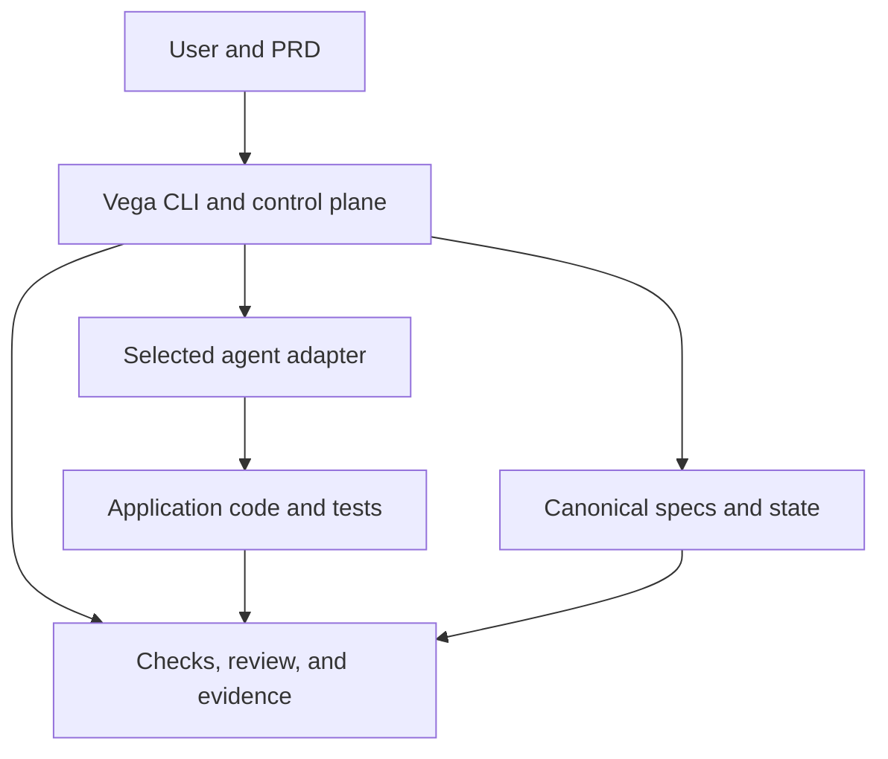
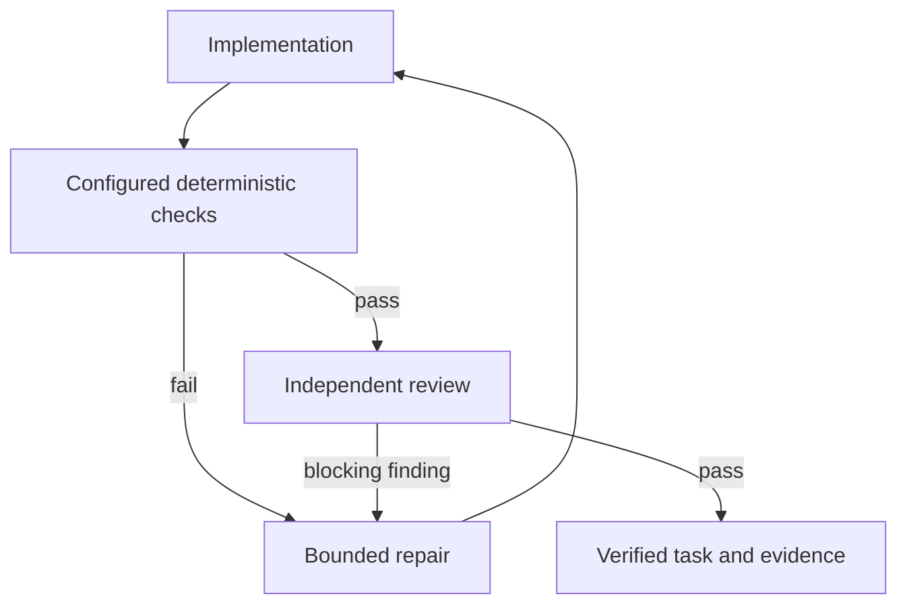

# Vega SDD Architecture

This document describes the 0.4.0 controller. Graphify is optional retrieval and Headroom is optional prompt compression; neither replaces canonical `.sdd/` state or imposes a token-stop policy. See [project lifecycle](PROJECT_LIFECYCLE.md) for delivery and [0.4.0 verification](VERIFICATION_0.4.0.md) for tested boundaries.

## System shape

The control plane contains product discovery, architecture/spec generation, state and dependency scheduling, change reconciliation, verification/repair, optional Graphify retrieval, optional Headroom compression, and the event journal. The adapter layer normalizes Cursor, Codex, Claude, Gemini, Copilot, and mock provider behavior.

## Ownership boundaries

The controller owns canonical state transitions. An agent may edit application code during writable tasks, but it is instructed not to mark `.sdd/state` complete. The mutation guard protects controller runtime baselines and projection recovery records as well as canonical state. This protects recovery from agent self-reporting.

Architecture/spec generation is returned as structured JSON and validated with Pydantic before the controller writes canonical artifacts. Approved change reconciliation uses the same pattern.

## Capability routing

The controller selects one lifecycle skill for the current phase and a small set of task/domain skills. A task can declare explicit skill names; skills can also expose phase-and-trigger routing metadata. Missing explicit skills block execution. The context pack carries compact descriptions and exact paths, so the agent loads only the selected runbooks.

Roles are independent of skills: developer or QA is the primary perspective, with security, integration, reliability, performance, E2E, or agent-system reviewers added when the routed risks require them. Roles and skills guide judgment; they never grant tools, approve a change, or write canonical state. The controller and adapter enforce those boundaries.

For real-agent projects, workspace approval binds the execution policy and a bounded digest of governing instructions across `AGENTS.md`/`CLAUDE.md`/`GEMINI.md`, nested instruction files, Copilot/Cursor configuration, vendor agent copies, roles, and skills. Editing a capability invalidates approval. Initialization runs in an isolated framework workspace with a bounded source copy that omits those instructions and common secret files; after initialization, every real-agent entry point requires current approval.

## State model

`ProjectState` tracks run state, active run, current feature/task, pause/stop requests, and initialization status.

Each `Feature` contains task state. Each `Task` has stable identity, dependency links, requirement mappings, verification criteria, attempt count, and evidence IDs.

The event journal is append-only and supplements (but does not replace) current-state YAML.

## Scheduler

A feature is runnable only after all feature dependencies are verified. A task is runnable only after all task dependencies are verified. The scheduler scans the ordered feature list and selects the first ready task.

V1 deliberately uses a single writer. This avoids concurrent edit conflicts and lets the repo/task DAG mature before parallel worktree orchestration is added.

## Verification flow

Deterministic checks have priority over LLM confidence. A failing configured command blocks review completion.

## Change safety

The classifier separates implementation defects from intent changes. Implementation defects become new repair tasks. Intent changes require explicit approval and structured reconciliation.

During reconciliation, stable unaffected task IDs carry forward their execution status. Explicitly invalidated tasks lose evidence and return to incomplete state. Traceability is validated before development resumes.

## Security model

Vega SDD executes local coding-agent CLIs with the permissions configured for those tools. It does not store provider API keys itself. Secrets remain under the coding agent/vendor's authentication mechanism and local environment.

The framework cannot make a permissive coding-agent configuration safe. Use each provider's sandbox/approval controls and least-privilege credentials appropriate for the repository.

## Retrieval and prompt size

`sdd graph refresh` builds `graphify-out/graph.json` with Graphify's local code extractor. Context packs call `graphify query` with the task and its acceptance criteria and tell the agent to query Graphify before Read or Grep. The traceability corpus is a Markdown file Graphify can sit beside; it is not a second scheduler.

Headroom's `compress()` runs inside the controller because `sdd start` launches one-shot subprocesses. `headroom wrap` is an interactive session and is not the hook. Originals stay on disk. When Headroom is absent, or when compression does not shorten the text, the controller sends the existing excerpt and records that fact. Savings are a journal (`compression-ledger.yaml`), not a budget. Failed tasks are skipped until `sdd task retry`. Review policy ignores low and warning findings that do not violate acceptance criteria.
