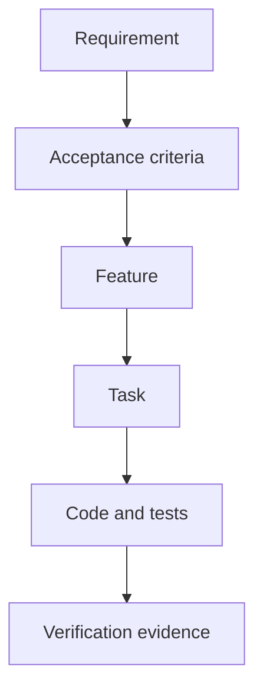

# Specification and Traceability Model

Vega SDD uses structured identity across product intent and implementation.

## Requirements

A requirement includes:

- stable ID (`REQ-...`),
- title and normative statement,
- functional/non-functional/constraint type,
- must/should/could priority,
- source,
- acceptance criteria,
- status.

## Features

A feature includes:

- stable feature ID,
- human-readable purpose,
- requirement references,
- feature dependencies,
- bounded tasks,
- feature status.

## Tasks

A task includes:

- stable task ID,
- owning feature ID,
- description,
- requirements implemented,
- task dependencies,
- deterministic verification expectations,
- up to eight safe project/domain skill names (lifecycle skills remain controller-selected),
- attempts/evidence/status.

## Why YAML plus Markdown

Markdown is convenient for users and coding agents to inspect. YAML is safer for controller state transitions and graph validation. The controller writes both views from structured objects where practical.

## Manual edits

Manual edits to human-readable generated Markdown can drift from machine state. Prefer `sdd change` for intent changes. If machine state is edited manually, run `sdd verify` immediately and inspect the corresponding generated views.
